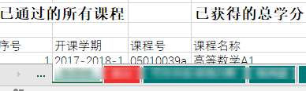
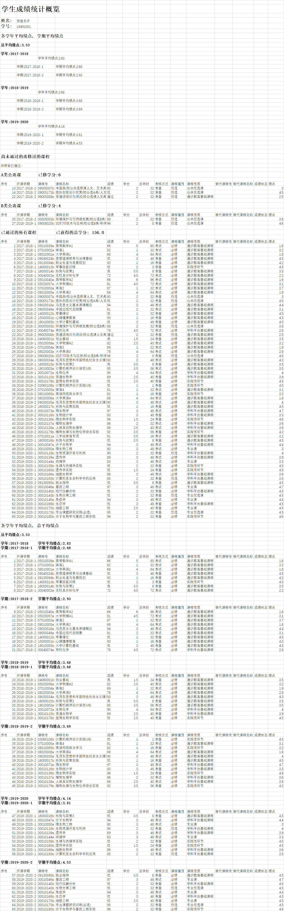

# JUSTScoreSummary

此程序主要用于`江苏科技大学2017级生物技术班`的**成绩统计**使用.

任何其他同学使用此程序可能会出现程序无法处理的问题而崩溃.

请及时联系我进行维护,谢谢大家了^_^

可以快速把**单个**同学的`各学期/学年/总学分绩点`,`公选课总分/选课`,`未/已通过课程`等信息汇总在 `{学号}-{姓名}-Summary.xlsx` 文件里.

在此感谢17生物技术的各位同学们反馈的各种BUG.

在各位的帮助下, 得以让此程序拥有更宽广的眼界和胸怀, 而不再面对未知直接崩溃.

## 技术路线

采用 [Requests](https://requests.readthedocs.io/zh_CN/latest/) 登录`教务系统` 并获取个人信息和成绩源数据

使用 [Pandas](https://pandas.pydata.org/) 获取成绩页面的`<table>`标签并转为`DataFrame`

按照[学校的计分规则](http://jwc.just.edu.cn/2018/0328/c5744a51661/page.htm)自编计算绩点和筛选成绩的函数[^ 函数精度]

[^函数精度]: https://docs.python.org/zh-cn/3/library/decimal.html 函数采用 Decimal 计算保证精度

使用 [openpyxl](http://openpyxl.readthedocs.io/) 按照设计的样式和计算的结果生成 `Summary` 文件

## 特性 Features

1. 命令行式界面

2. 输入账号密码自动生成 `Summary` 文件

3. 可将此项目做库导入使用,包含一个学生成绩相关的类,类有如下方法:

   - public_elective(file_name=''): 返回`公选课`DF, 如果导入文件名直接输出xls,

   - theory_schedule(file_name = ''): 返回`学期理论课表`,

   - now_no_pass(): 返回尚`未通过的课程`,

   - training_program(file_name = ''): 返回`培养方案`,

   - add_academic_credits(table_df, ignore=True):在传入的表的最右侧加一列`学分绩点`,并返回 修改过的表/表格内的平均绩点/总学分; `ignore`参数为在计算平均绩点和总学分的时候是否忽略公选课,体育课和补考通过的课程

   - point_summary(): 返回绩点字典,包含 总平均绩点/各学年学期绩点

   - ......

由于是特定班级使用所以有一定的局限性

- 公选课的识别可能只覆盖了自己班内部的,不够全面

- 自动化的`Summary`文件只统计了需要的几个课程信息不一定是你需要的

## 使用我吧

你可以直接使用打包好的`exe可执行文件` 

这里下载 [下载请点我](https://github.com/YuanZ1949/JUSTScoreSummary/releases/tag/JUSTScoreSummary) , 双击即可运行 `Window` 系统下直接运行(建议右键以管理员模式运行,防止文件生成Excel时报错).

你也可以直接下载源代码使用

安装`Python` 或者是 `Anaconda` 使用这个源代码

在终端比如  `cmd` 里,进入该项目文件夹后,使用这个命令:

> pip install -r requirements.txt

这样就安装了需要的库, 然后在终端输入指令:

> python JUSTScoreSummary.py

### 小工具

在该仓库的 `othertool` 里有些小工具

- `classloop.py` : 可以将此py文件放在主要代码的同一目录, 然后在同目录自己创建一个 `account.txt` 文件, 里面按照`学号 密码`的形式一行放一位同学的账号, 启动程序后, 就可以按顺序生成不同同学的 `Summary`文件了.

- `班级汇总宏(使用我合并文档).xlsm` : 得到的 `Summary` 文件使用这个文档里的`宏`来合并.

## 样例

最后生成的`summary`文件为`xlsx`文件, 一个同学一个同名工作表(sheet)

而且如果有未通过的课程, 工作表的标签颜色将变成红色:

以下是某位同学的成绩, 这里作为最终的`summary`文件的样例列出:

